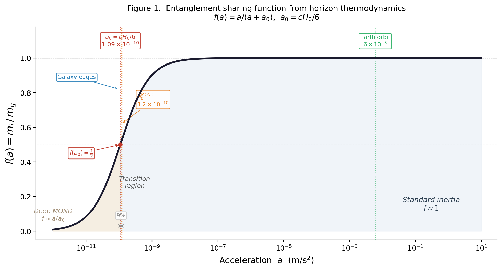

# Quantized Inertia from Jacobson's Thermodynamic Spacetime

**A boundary correction to horizon entropy derives McCulloch's Quantized Inertia from first principles.**

---

Jacobson (1995) showed that the Einstein field equations emerge from thermodynamics at local Rindler horizons, assuming the Bekenstein-Hawking entropy $S = A/4$. His derivation implicitly assumes an infinite mode spectrum. In a universe of finite extent, the Hubble horizon truncates the infrared sector of the vacuum modes, reducing the effective entropy below $S = A/4$.

We propagate this finite-boundary correction through Jacobson's machinery and obtain, in the non-relativistic weak-field limit:

```math
m_i(a) = m_g \left[1 - \left(\frac{a_0}{a}\right)^2\right]
```

where $a_0 = cH_0 \approx 6.9 \times 10^{-10}$ m/s$^2$ is derived from the geometry of nested horizons with **no free parameters**. This is McCulloch's Quantized Inertia (2007).

Standard inertia ($m_i = m_g$) is recovered at high accelerations. At low accelerations ($a \to a_0$), inertia vanishes, producing flat galaxy rotation curves from baryonic mass alone.



*Modified inertial mass ratio $m_i/m_g$ as a function of acceleration, showing the transition from standard inertia to the self-regulation regime at $a_0 = cH_0$.*

---

## Contents

| File | Description |
|------|-------------|
| [**Paper.md**](Paper.md) | Full paper with derivation, predictions, and references |
| [Draft-v2.md](Draft-v2.md) | Clean LaTeX-ready source (same content) |
| [**Figure1.png**](Figure1.png) | Modified inertial mass ratio vs. acceleration |
| [**figure1.py**](figure1.py) | Reproducible figure source (Python/matplotlib) |
| [**LiteratureSearch.md**](LiteratureSearch.md) | Comprehensive prior art survey (35+ papers) |

## Key Results

- **Equation 18**: $m_i(a) = m_g[1 - (a_0/a)^2]$ — McCulloch's QI from Jacobson's framework
- **No free parameters**: $a_0 = cH_0$ derived from horizon geometry
- **Tully-Fisher**: $v^4 = GMcH_0$ follows directly (Eq. 23)
- **Standard physics recovered**: correction is $\sim 10^{-14}$ at Earth orbit

## Context

This paper sits at the intersection of:
- **Jacobson (1995)** — Einstein equations as thermodynamic equation of state [3,500+ citations]
- **McCulloch (2007-2017)** — Quantized Inertia from Unruh radiation asymmetry [~200 citations]
- **MOND phenomenology** — but modifying *inertia*, not *gravity*

No prior work derives QI from Jacobson. The niche is open. See [LiteratureSearch.md](LiteratureSearch.md) for the full survey.

## Authors

Keith Brodie, with AI assistance (Claude/Anthropic, Grok/xAI)

## Status

Draft v2 — under review.

## License

This work is shared for scientific discussion. Please cite appropriately.
